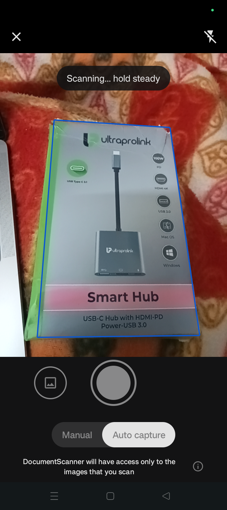
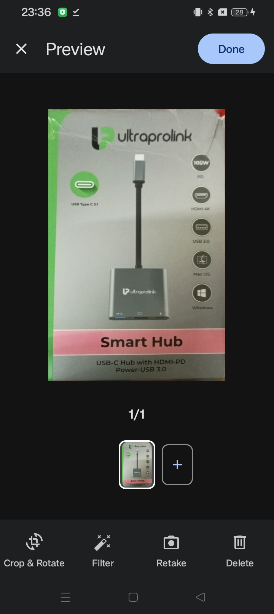
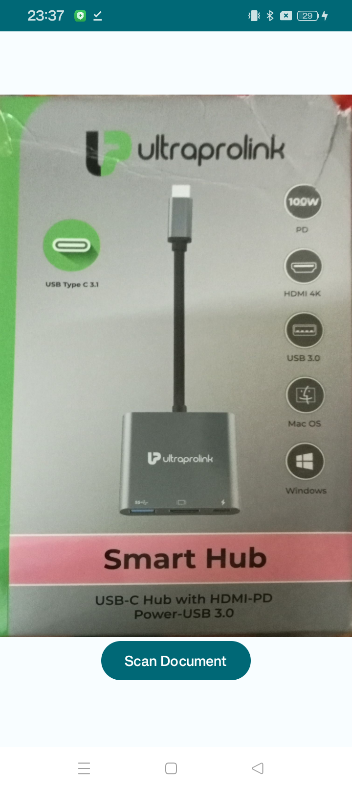

# Document Scanner App with MLKit

## Overview
This repository contains the source code for a document scanner app built using MLKit, Google's machine learning platform. With this app, you can effortlessly scan documents using your smartphone's camera and extract text from images. The app works entirely offline and is free to use.

## Home Page

## Scan Document

## After Scan Image Preview

## Final Output

## Features
- **Efficient Scanning**: Transform your smartphone into a portable scanner for documents.
- **Offline Functionality**: No internet connection required; process documents entirely offline.
- **User-Friendly Interface**: Intuitive design for easy navigation and usage.
- **Customization**: Easily customize the app to suit your specific needs or preferences.

## Requirements
- Android Studio
- Android SDK
- Google Play services
- MLKit library

## Installation
1. Clone this repository: `git clone https://github.com/DevNoLimit/document-scanner-app.git`
2. Open the project in Android Studio.
3. Build and run the app on your device or emulator.

## Usage
1. Launch the app on your smartphone.
2. Position the camera over the document you wish to scan.
3. Tap the capture button to take a picture.
4. Review the scanned document and make any necessary adjustments.
5. Save or share the scanned document as needed.

## Contributing
Contributions are welcome! Please feel free to submit issues or pull requests.

## License
This project is licensed under the MIT License - see the [LICENSE](LICENSE) file for details.
